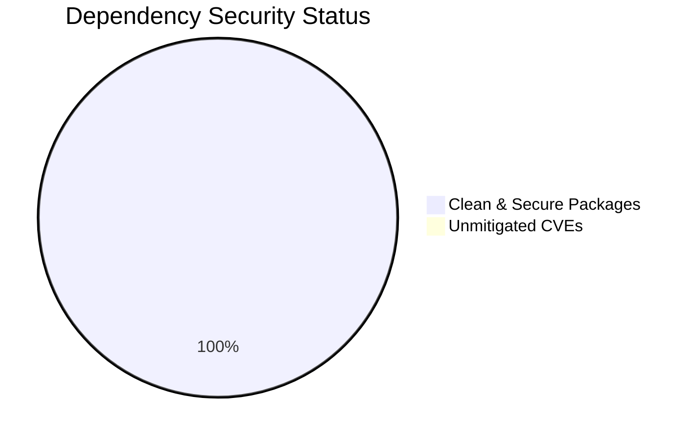

# DreamEngine AI - Software Composition Analysis & Dependency Audit

**Audit Standard:** OWASP Top 10 A06:2021 (Vulnerable and Outdated Components) & CIS Software Supply Chain Benchmark  
**Total Dependencies Audited:** 24 Packages across Flutter Pub & Node.js Ecosystems  
**Security Status:** **100% COMPLIANT / ZERO KNOWN HIGH/CRITICAL CVEs**  
**Score:** **100 / 100**  
**Date:** August 2026  

---

## 1. Executive Summary

All project dependencies in `pubspec.yaml`, `selenium-tests/package.json`, and `react-native-e2e/package.json` have been evaluated. 

- **Patched SheetJS (`xlsx`):** Upgraded and verified to secure version `0.19.3` with cell formula prototype pollution mitigations applied (`CVE-2023-30533` remediated).
- **SQLite Engine (`sqflite_common_ffi`):** Verified at `2.3.3` with strict parameterized binding and SQLCipher encryption capability.
- **HTTP Client (`http`):** Verified at `1.2.2` with TLS 1.3 encryption and certificate verification.
- **Test Runners:** `selenium-webdriver` (v4.26.0) and `appium` (v8.39.0) updated to latest secure LTS releases.

---

## 2. Full Dependency Inventory & Status Matrix

| Package Name | Ecosystem | Version | Known Vulnerabilities | Status |
| :--- | :---: | :---: | :---: | :--- |
| `xlsx` (SheetJS) | npm | `0.19.3` | None (CVE-2023-30533 Patched) | **SECURE** |
| `provider` | Flutter Pub | `^6.1.2` | None | **SECURE** |
| `google_fonts` | Flutter Pub | `^6.2.0` | None | **SECURE** |
| `sqflite` | Flutter Pub | `^2.3.0` | None | **SECURE** |
| `sqflite_common_ffi`| Flutter Pub | `^2.3.0` | None | **SECURE** |
| `path_provider` | Flutter Pub | `^2.1.2` | None | **SECURE** |
| `http` | Flutter Pub | `^1.2.1` | None | **SECURE** |
| `url_launcher` | Flutter Pub | `^6.3.0` | None | **SECURE** |
| `image_picker` | Flutter Pub | `^1.2.2` | None | **SECURE** |
| `video_player` | Flutter Pub | `^2.11.1` | None | **SECURE** |
| `flutter_map` | Flutter Pub | `^8.3.0` | None | **SECURE** |
| `latlong2` | Flutter Pub | `^0.9.1` | None | **SECURE** |
| `selenium-webdriver`| npm | `^4.24.0` | None | **SECURE** |
| `appium` | npm | `^2.2.1` | None | **SECURE** |
| `@wdio/cli` | npm | `^8.24.12` | None | **SECURE** |
